# Codex via WhatsApp

  

A local gateway that forwards WhatsApp messages (only from your number) to `codex exec`.

## Architecture

1. WhatsApp linked device (QR) -> Baileys Socket
2. Number filter (`ALLOWED_WHATSAPP_NUMBER`)
3. Queue + Runner
4. `codex exec -C <WORKDIR> ...` on your machine
5. Response sent back to WhatsApp

## Setup

1. Create `.env`:
   - `Copy-Item .env.example .env`
2. Set values in `.env`:
   - `ALLOWED_WHATSAPP_NUMBER` (your number, digits only, country code included; `0049...` is auto-normalized to `49...`)
   - `CODEX_WORKDIR` (folder you want to control via WhatsApp)
3. Install dependencies:
   - `npm install`
4. Verify config:
   - `npm run verify-config`
5. Start:
   - `npm start`
6. Scan the terminal QR code in WhatsApp -> Linked Devices.
7. Run only one instance at a time (do not run `npm start` twice in parallel).

## Usage

- Every normal message (without `/`) is sent as a prompt to Codex.
- "Message yourself" is supported (your own number), and echo loops from gateway responses are blocked.
- Commands:
  - `/help` (quick overview)
  - `/guide` (step-by-step for non-technical users)
  - `/status`
  - `/session` (show stored Codex session id)
  - `/pwd` (show current Codex workdir)
  - `/cd <path>` (change Codex workdir)
  - `/cd-reset` (reset workdir to `.env` default)
  - `/fav-list` (list favorite folders)
  - `/fav-add <name> <path>` (save favorite folder)
  - `/fav-rm <name>` (remove favorite folder)
  - `/fav <name>` (switch to favorite folder)
  - `/pc` (open Codex terminal on your PC; resume if session is available)
  - `/stop` (stop active run and clear queue)
  - `/new` (start a fresh Codex context)

## Important Notes

- This setup uses WhatsApp Web via Baileys (OpenClaw-style), not the official Meta Business API.
- Inbound processing is hard-filtered to one specific number.
- Only direct chats (`@s.whatsapp.net`) are processed, no groups.
- Session and runtime files are stored by default in `%USERPROFILE%\\memory\\whatsapp-codex`.
- Codex context is persisted via `session id` so you can continue across messages.
- The gateway uses a global lock file at `%TEMP%\\codex-via-whatsapp-<number>.lock` to prevent accidental parallel instances.
- After a hard crash, you can clean it up with: `del %TEMP%\\codex-via-whatsapp-<number>.lock`

## Validation (Machine-checkable)

- Syntax check: `npm run check`
- Config check: `npm run verify-config`

## Open Source

- License: `MIT` (see `LICENSE`)
- Contributing: `CONTRIBUTING.md`
- Security: `SECURITY.md`
- Code of Conduct: `CODE_OF_CONDUCT.md`
- Release checklist: `OPEN_SOURCE_CHECKLIST.md`
